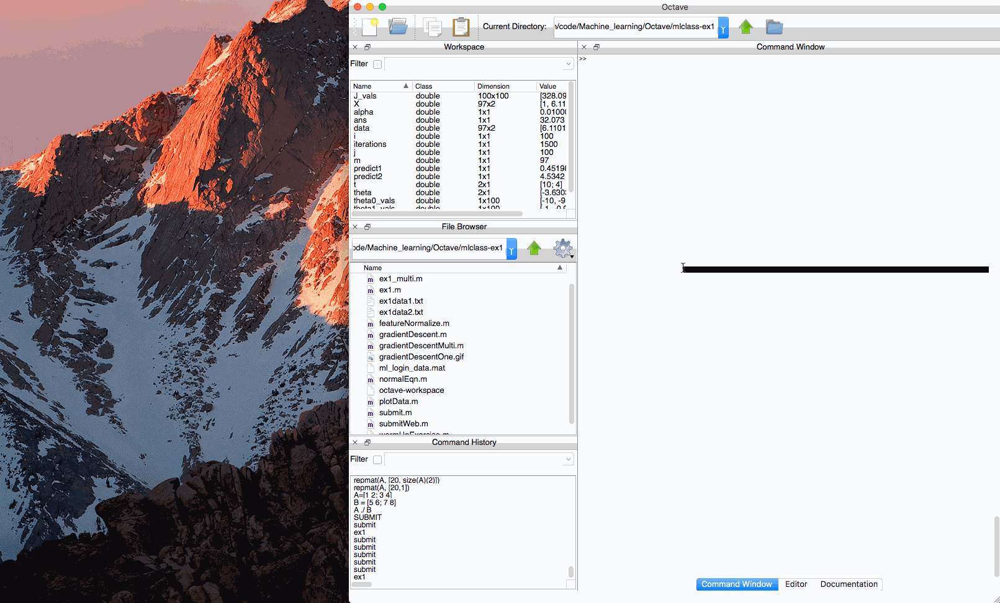

# Linear Regression*

implement linear regression and get to see it work on data.

Submitted by: **Tristan Yan**

## User Stories

The following **required** functionality is complete:

* [X] [warmUpExercise.m](./warmUpExercise.m) - Simple example function in Octave/MATLAB 
* [X] [plotData.m](plotData.m) - Function to display the dataset
* [X] [computeCost.m](computeCost.m) - Function to compute the cost of linear regression
* [X] [gradientDescent.m](gradientDescent.m) - Function to run gradient descent

The following **optional** features are implemented:

* [X] [computeCostMulti.m](computeCostMulti.m) - Cost function for multiple variables
* [X] [gradientDescentMulti.m](gradientDescentMulti.m) - Gradient descent for multiple variables 
* [X] [featureNormalize.m](featureNormalize.m) - Function to normalize features
* [X] [normalEqn.m](normalEqn.m) - Function to compute the normal equations

## Video Walkthrough 

Here's a walkthrough of gradient descent for one variable:

GIF created with [LiceCap](http://www.cockos.com/licecap/).

## License

    Copyright [2017] [Tristan Yan]

    Licensed under the Apache License, Version 2.0 (the "License");
    you may not use this file except in compliance with the License.
    You may obtain a copy of the License at

        http://www.apache.org/licenses/LICENSE-2.0

    Unless required by applicable law or agreed to in writing, software
    distributed under the License is distributed on an "AS IS" BASIS,
    WITHOUT WARRANTIES OR CONDITIONS OF ANY KIND, either express or implied.
    See the License for the specific language governing permissions and
    limitations under the License.
